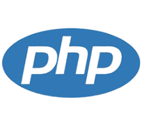

# Repositório para Desenvolvimento de Projetos em PHP

Resolução dos exercícios propostos na disciplina de "Programação WEB", pertencente à grade curricular do 5º termo do curso de Análise e Desenvolvimento de Sistemas da FATEC de Presidente Prudente-SP.

🙏 **Facilitadora: Prof.ª Mestre VANESSA DOS ANJOS BORGES**

📚 **Ementa:**

- Implementar aplicações WEB em servidores: conhecimento da linguagem PHP e padrões.
- Realizar controle de sessões, cookies, request/response e conexão com Banco de Dados.

🎬 **Conteúdos em PHP:**

- Programação Orientada a Objetos em PHP;
- PHP Standart Recommendations (PSRs);
- Princípios de Código Limpo e Arquitetura Limpa;
- Aplicações com Composer e arquitetura MVC;
- Framework Laravel;
- Arquitetura de Software Orientada a Serviços;

⚓ **Referências Bibliográficas**

📖 NARAMORE, E.; GERNER, J.; BORONCZYK, T. *Beginning PHP 6, Apache, MYSQL 6 Web Development*. John Wiley Consumer, 2009.

📖 BORGES JR, M. P. *Desenvolvendo Webservices - Guia Rápido Usando Visual Studio.Net com Banco de dados*. Ciência Moderna, 2005.

📖 KURNIAWAN, B. *Java para Web com Servlets, JSP e EJB*. São Paulo: Ciência Moderna, 2002.

🔗 [PHP: The Right Way](https://phptherightway.com/)

🔗 [PHP Manual](https://www.php.net/manual/en/) - Acesso em: 11 ago. 2024.

🔗 [W3SCHOOLS - PHP Tutorial](https://www.w3schools.com/php/)

🔗 [LARACASTS - Laracasts: PHP for Beginners](https://laracasts.com/)
